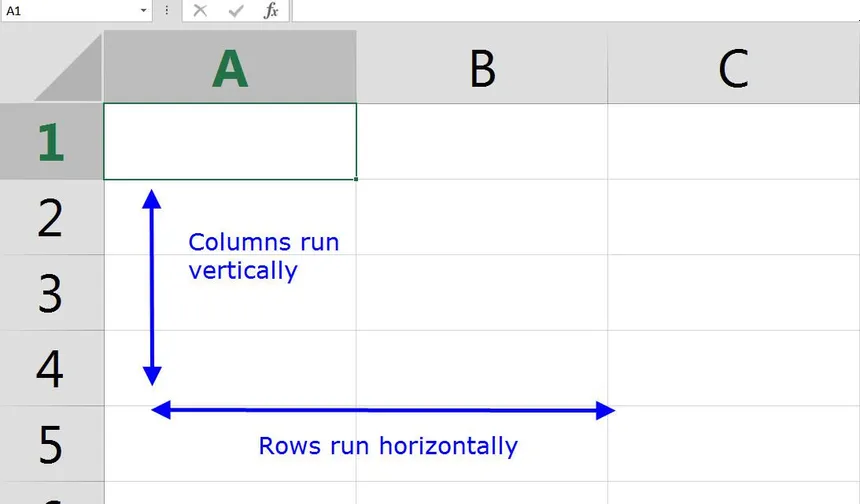
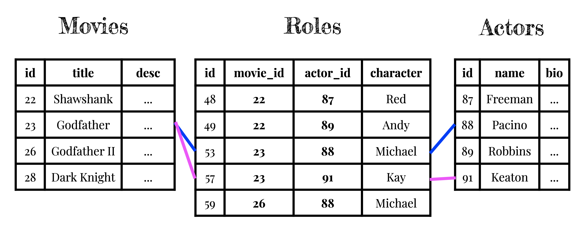
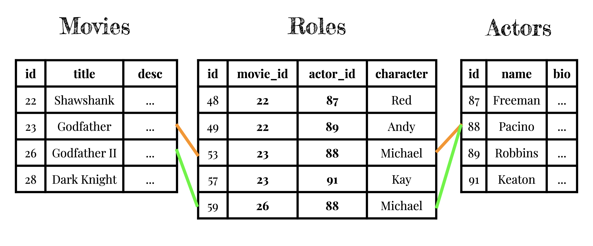

# <!--fit--> Record Keeping

A history of record keeping and a first look at database design

---
# <!--fit--> The foundation of the world was the written word

<!-- important to know how to read/write -->

---

---

---

---

# <!--fit--> The foundation of the world today is software

<!-- important to know how to read/write software -->

---

---

---

---

# <!--fit--> What were they writing?

<!-- copying manuscripts and other texts as well as secretarial and administrative duties such as the taking of dictation and keeping of business, judicial, and historical records for kings, nobles, temples, and cities. -->

<!-- legal transactions, births and deaths, political acts, and financial records. -->

---

# <!--fit--> Who is the first person whose name we know?

- name?
- what were they signing?

---

# <!--fit--> "29,086 measures barley; 37 months"
— Kushim (c. 3400–3000 BC)

---

"It is telling that the first recorded name in history belongs to an accountant, rather than a prophet, a poet, or a great conqueror."

— Yuval Noah Harari, Sapiens: A Brief History of Humankind

---

## <!--fit--> What were they printing?

## <!--fit--> What was the best-selling book?

---

- English almanacs were bestsellers in the 17th century
    - (second to the Bible)
- An almanac is an annual publication that includes information such as:
   - weather forecasts
   - farmers' planting dates
   - tide tables
   - tabular information often arranged according to the calendar.

---

# <!--fit--> The killer application of writing, and printing, was *record keeping*

---

# <!--fit--> The killer application of computing is also *record keeping*

---

# <!--fit--> The heart of any application is the information it is keeping track of.

- Users, tweets, and who-follows-who in **Twitter**.
- Listings, bookings, and messages in **Airbnb**.
- Venues, reviews, and ratings in **Yelp**.

---

# <!--fit--> In the beginning, there was Craigslist

A categorized list of records

---
# Record Keeping

- We keep track of this information as records in plain old tables — just like they did in almanacs in the 17th century.
- One of the most important parts of application development is figuring out what information we need to keep track of, and a good set of tables to organize that information.

---
# Data Modeling

- This is part of the process known as **data modeling** (or "database design" or "database architecture").
- It's the most important and most challenging part of app development.
- It's an art, not a science. We'll spend time every week practicing. Let's dive in!

---
# Databases
- A *database* is the software we use to store information.
- It is just a set of tables
- It's like a spreadsheet where each table is one sheet.
- Try to think of them as just paper, like almanacs.

---

# Databases

- Whatever information we need to power our applications, we need to be able to figure out a way to store it in tables
- Whatever logic we need to solve our users' problems, we have to be able to describe how we'd do it as humans given paper tables.

---

# Databases
- Computers are just faster at doing this
- It will be the same operations:
    — looking up data that's relevant to a certian user
    - ordering things in certain way
    - filtering things by certain criteria
    - etc.

---
# One approach to database design
- We figure out the main things, "**nouns**", in our problem space and make a table for each.
- We add columns to each table for each attribute of the thing we need to keep track of.
- Our users create (or read, or update, or delete) rows.

---

# CRUD

- We say "create, read, update, or delete" so often — these are the fundamental 4 operations that all user actions map to — **CRUD**.
- 80%+ of the functionality of most SaaS applications is **CRUD**. This is what we will focus on learning how to build.

---

# Caveat #1
- Our users actions should not trigger creating tables or columns; only rows.
- We, the developers, will create all tables and columns up front, when we design and deploy the application.
- Users can **CRUD** a million rows per second if they want to.
- Users can't add tables or columns.

---

# Caveat #2

- **We will only store one value per cell.**
- A value can be a long blob of text, like a bio; but it can't be *multiple* bios for different people.

---

# Must See Movies

- Okay, this is all pretty abstract. Let's look at some examples.
- Lets examine an [application](https://msm.matchthetarget.com/) that we'll build in class. It's a very simplified version of the iMDB (the Internet Movie Database).
    - Click around it for a minute. Observe and identify:
    - How are the URLs named? What is indicated by each part of the URL?
    - What all information is being stored and displayed on each page?
    - If you had to design tables to store all of the information required to power that app, what would they be? What columns would they have? Think of questions.
- Let's experiment together.

---
<!-- SOURCE: https://firstdraft.slides.com/ianheraty/dpi-day-1#/82 -->

# Movies

|id|title|desc|director_name|director_bio|director_dob|
|-|-|-|-|-|-|
|22|Shawshank|...(long)|Darabont|...(long)|28-Jan-1959|
|23|Godfather|...(long)|Coppola|...(long)|07-Apr-1939|
|26|Godfather II|...(long)|Coppola|...(long)|07-Apr-1939|
|28|Dark Knight|...(long)|Nolan|...(long)|30-Jul-1970|

---

# Movies

|id|title|desc|director_name|director_bio|director_dob|actors|
|-|-|-|-|-|-|-|
|22|Shawshank|...(long)|Darabont|...(long)|28-Jan-1959|Freeman, Robbins|
|23|Godfather|...(long)|Coppola|...(long)|07-Apr-1939|Pacino, Keaton|
|26|Godfather II|...(long)|Coppola|...(long)|07-Apr-1939|Pacino|
|28|Dark Knight|...(long)|Nolan|...(long)|30-Jul-1970|Freeman|

---

# Movies

|id|title|desc|director_name|director_bio|director_dob|actors|actor_bios?|
|-|-|-|-|-|-|-|-|
|22|Shawshank|...(long)|Darabont|...(long)|28-Jan-1959|Freeman, Robbins|😭|
|23|Godfather|...(long)|Coppola|...(long)|07-Apr-1939|Pacino, Keaton|😭|
|26|Godfather II|...(long)|Coppola|...(long)|07-Apr-1939|Pacino|😭|
|28|Dark Knight|...(long)|Nolan|...(long)|30-Jul-1970|Freeman|😭|

---

---

---

---

---

---

# Many-to-many relationship

---

# Many-to-many relationship

---

# That's all for now. 

- It's an art, not a science. We'll spend time every week practicing.
